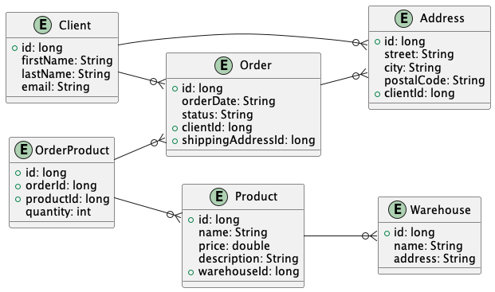

# Online Marketplace

## Описание проекта

Online Marketplace - это веб-приложение, представляющее собой онлайн-рынок, где пользователи могут просматривать, выбирать и покупать товары. Проект создан с использованием Java и включает в себя модели данных, хранящиеся в памяти, а также репозитории для взаимодействия с этими данными. Приложение поддерживает следующие сущности: клиенты, адреса, заказы, продукты, склады и т.д.


# 1 Атта
## Основные функции

1. **Управление клиентами**: Добавление, просмотр и редактирование данных о клиентах, включая их адреса.

2. **Управление товарами**: Добавление, просмотр и редактирование информации о продуктах, их ценах и описаниях.

3. **Оформление заказов**: Создание и просмотр заказов, включая выбор товаров, указание адреса доставки и статус заказа.

4. **Управление складами**: Добавление, просмотр и редактирование данных о складах, где хранятся продукты.
   Проект "Online Marketplace" включает следующие классы данных:

## Модели
1. **Address (Адрес):**
    - Поля: улица (`street`), город (`city`), почтовый индекс (`postalCode`), идентификатор клиента (`clientId`).
    - Связь: множество адресов принадлежит одному клиенту.

2. **Client (Клиент):**
    - Поля: имя (`firstName`), фамилия (`lastName`), электронная почта (`email`).
    - Связь: каждый клиент имеет множество адресов и заказов.

3. **Order (Заказ):**
    - Поля: статус заказа (`status`), идентификатор клиента (`clientId`), идентификатор адреса доставки (`shippingAddressId`).
    - Связь: каждый заказ принадлежит одному клиенту и связан с одним адресом.

4. **OrderProduct (Товар в заказе):**
    - Поля: идентификатор заказа (`orderId`), идентификатор продукта (`productId`), количество товара (`quantity`).
    - Связь: каждый товар в заказе связан с одним заказом и одним продуктом.

5. **Product (Продукт):**
    - Поля: название (`name`), цена (`price`), описание (`description`), идентификатор склада (`warehouseId`).
    - Связь: каждый продукт связан с одним складом.

6. **Warehouse (Склад):**
    - Поля: название (`name`), адрес (`address`).
    - Связь: множество продуктов хранится на одном складе.

Каждый класс данных (`Address`, `Client`, `Order`, `OrderProduct`, `Product`, `Warehouse`) является подклассом абстрактного класса `Model`, который содержит уникальный идентификатор (`id`).

```java
public abstract class Model {
    protected Long id;

    public Long getId() {
        return id;
    }

    public void setId(Long id) {
        this.id = id;
    }
}
```

Классы используют аннотации Lombok для удобного создания геттеров, сеттеров и конструкторов.

## Репозитории
Проект имеет архитектуру, в которой использованы репозитории для работы с данными, а также классы для представления моделей и их хранения в памяти. Вот краткое описание каждого класса:

1. **`Repository<T extends Model>`:**
   - Интерфейс, предоставляющий базовые методы для работы с объектами типа `T` (create, read, update, delete).
   - Поддерживает операции чтения всех объектов, чтения объекта по идентификатору и обновления объекта по идентификатору.

2. **`AddressRepository` (расширяет `Repository<Address>`):**
   - Интерфейс для работы с адресами, включая дополнительный метод `getByClientId` для получения адресов по идентификатору клиента.

3. **`OrderRepo` (расширяет `Repository<Order>`):**
   - Интерфейс для работы с заказами, включая дополнительный метод `getByClientId` для получения заказов по идентификатору клиента.

4. **`ProductRepository` (расширяет `Repository<Product>`):**
   - Интерфейс для работы с продуктами, включая дополнительный метод `getByOrderId` для получения продуктов по идентификатору заказа.

5. **`RepoLib`:**
   - Интерфейс, предоставляющий методы для получения репозиториев различных моделей (адреса, клиента, заказа и т. д.).

6. **Классы репозиториев в памяти (`AddressMemoryRepo`, `ClientMemoryRepo`, `OrderMemoryRepo`, `OrderProductMemoryRepo`, `ProductMemoryRepo`, `WarehouseMemoryRepo`):**
   - Реализации репозиториев в памяти, основанные на абстрактном классе `RepositoryMemory`.
   - Включают дополнительные методы проверки внешних ключей и получения объектов по определенным критериям.

7. **`MemoryRepoLib`:**
   - Реализация интерфейса `RepoLib`, предоставляющая экземпляры репозиториев в памяти для работы с адресами, клиентами, заказами и т. д.

Проект структурирован и использует подходы, облегчающие работу с данными в памяти. Репозитории в памяти предоставляют базовые методы для работы с данными, а интерфейс `RepoLib` абстрагирует доступ к различным репозиториям моделей.

## Генератор данных и Сериализация/Десериализация

### Генератор данных (Generator)

Генератор (`Generator`) представляет собой инструмент для создания фиктивных данных и наполнения хранилища. Он создает клиентов, адреса, склады, продукты, заказы и связи между ними для имитации работы онлайн-рынка.

#### Пример использования:

```java
RepoLib repoLib = MemoryRepoLib.getINSTANCE();
Generator.Generate(repoLib);
```

Генератор создает случайных клиентов, адреса, склады и продукты, а также связывает их между собой.

### Сериализация и Десериализация (Serializer и Deserializer)

`Serializer` и `Deserializer` предназначены для сохранения и загрузки данных из файла. Они используют библиотеку Jackson для работы с форматом JSON.

#### Пример использования сериализации:

```java
Serializer.serialize(new File("dump.json"), repoLib);
```

Сериализатор сохраняет текущее состояние хранилища в JSON-файл.

#### Пример использования десериализации:

```java
Deserializer.deserializer(new File("dump.json"), repoLib);
```

Десериализатор восстанавливает данные из JSON-файла, создавая объекты и восстанавливая связи между ними.

### Класс DbWrapper

`DbWrapper` служит для обертывания списков объектов разных классов и предоставляет единый интерфейс для сериализации и десериализации.

## Запуск приложения

Главный класс `Main` позволяет выбрать между генерацией новых данных и загрузкой существующих. В зависимости от выбора, происходит либо вызов генератора, либо десериализация из файла.

```java
public class Main {
    public static void main(String[] args) {
        // ...

        if (Objects.equals(s, "w")) {
            Generator.Generate(repoLib);
            Serializer.serialize(new File("dump.json"), repoLib);
        } else {
            Deserializer.deserializer(new File("dump.json"), repoLib);
            printInfo();
            // ...

        }
    }
    // ...
}
```

Выбор "w" означает запись данных, а "r" - чтение.

## Дополнительные функции

### Печать информации о клиентах и заказах

Метод `printInfo` выводит информацию о клиентах и связанных с ними заказах. Это полезный метод для проверки корректности данных после загрузки.

```java
public static void printInfo() {
    // ...
}
```

## Использованные подходы/инструменты
### Инструменты:

#### 1. **Lombok:**
- **Описание:** Lombok – это библиотека для Java, предназначенная для автоматизации рутинных задач в коде, таких как генерация геттеров, сеттеров, конструкторов и других методов.
- **Пример:**
  ```java
  @Getter
  @AllArgsConstructor
  @NoArgsConstructor
  public class Address extends Model {
      protected String street;
      protected String city;
      protected String postalCode;
      protected long clientId;
  }
  ```
- **Рассказ:**
   - Аннотации Lombok упрощают написание классов, делая код более читаемым и уменьшая объем шаблонного кода.
   - Пример выше демонстрирует использование аннотаций для генерации геттеров, конструкторов и сеттеров.

#### 2. **Jackson (ObjectMapper):**
- **Описание:** Jackson – это библиотека для обработки форматов данных JSON в Java. `ObjectMapper` из Jackson используется для преобразования объектов Java в JSON и наоборот.
- **Пример:**
  ```java
  public class Serializer {
      public static void serialize(File file, RepoLib repoLib){
          ObjectWriter objectWriter = new ObjectMapper().writerWithDefaultPrettyPrinter();
          DbWrapper dbWrapper = new DbWrapper(
                  repoLib.getAddressRepo().read(),
                  repoLib.getAClientRepo().read(),
                  repoLib.getOrderRepo().read(),
                  repoLib.getOrderProductRepo().read(),
                  repoLib.getProductRepo().read(),
                  repoLib.getWarehouseRepo().read()
          );
          try {
              objectWriter.writeValue(file, dbWrapper);
          } catch (JsonProcessingException e) {
              throw new RuntimeException(e);
          } catch (IOException e) {
              throw new IllegalArgumentException("wrong file");
          }
      }
  }
  ```
- **Рассказ:**
   - `ObjectMapper` упрощает сериализацию объектов в JSON и десериализацию JSON в объекты.
   - Пример демонстрирует использование `ObjectMapper` для записи объектов из репозиториев в файл JSON.

### Подходы:

#### 1. **Инкапсуляция:**
- **Описание:** Инкапсуляция – это принцип объектно-ориентированного программирования, заключающийся в ограничении доступа к внутренним компонентам объекта и предоставлении доступа только через внешний интерфейс.
- **Пример:**
  ```java
  @Getter
  @AllArgsConstructor
  @NoArgsConstructor
  public class Address extends Model {
      protected String street;
      protected String city;
      protected String postalCode;
      protected long clientId;
  }
  ```
- **Рассказ:**
   - Аннотация `@Getter` из Lombok генерирует геттеры для полей класса, предоставляя доступ только для чтения.

#### 2. **Полиморфизм:**
- **Описание:** Полиморфизм позволяет объектам использовать методы своих подтипов. В Java это может быть достигнуто через переопределение методов в подклассах.
- **Пример:**
  ```java
  @Getter
  @AllArgsConstructor
  @NoArgsConstructor
  public class DbWrapper {
      List<Address> addresses;
      List<Client> clients;
      List<Order> orders;
      List<OrderProduct> orderProducts;
      List<Product> products;
      List<Warehouse> warehouses;
  }
  ```
- **Рассказ:**
   - Класс `DbWrapper` использует полиморфизм для хранения коллекций различных моделей (адресов, клиентов и т. д.) в одном объекте.

#### 3. **Наследование:**
- **Описание:** Наследование позволяет классу наследовать свойства и методы от другого класса. В Java это достигается с помощью ключевого слова `extends`.
- **Пример:**
  ```java
  public class AddressRepositoryMemory extends RepositoryMemory<Address> implements AddressRepository {
      // реализация методов AddressRepository
  }
  ```
- **Рассказ:**
   - Класс `AddressRepositoryMemory` наследует функциональность от абстрактного класса `RepositoryMemory` и реализует интерфейс `AddressRepository`.

#### 4. **Singleton:**
- **Описание:** Синглтон гарантирует, что у класса есть только один экземпляр, и предоставляет глобальную точку доступа к этому экземпляру.
- **Пример:**
  ```java
  public class AddressMemoryRepo extends RepositoryMemory<Address> implements AddressRepository {
      private AddressMemoryRepo() { }

      private static AddressMemoryRepo INSTANCE;

      public static AddressMemoryRepo getINSTANCE(){
          if(INSTANCE == null) {
              INSTANCE = new AddressMemoryRepo();
          }
          return INSTANCE;
      }
      // ...
  }
  ```
- **Рассказ:**
   - Класс `AddressMemoryRepo` реализует шаблон синглтона, чтобы гарантировать существование только одного экземпляра репозитория в памяти.

# 2 Атта
В коде реализовано взаимодействие с базой данных PostgreSQL с использованием JDBC и библиотеки Flyway для миграции схемы базы данных. Давайте разберем основные моменты и подходы, примененные в этой системе.

1. **Flyway для миграции базы данных:**
   ```groovy
   plugins {
       id("org.flywaydb.flyway") version "10.0.1"
   }
   ```

   В данном проекте используется плагин Flyway для автоматизации миграции базы данных. Он позволяет определить изменения в схеме базы данных в виде SQL-скриптов, которые будут применены автоматически при запуске приложения.

   Пример SQL-скрипта миграции:
   ```sql
   CREATE TABLE client (
       id SERIAL PRIMARY KEY,
       firstName VARCHAR(255) NOT NULL,
       lastName VARCHAR(255) NOT NULL,
       email VARCHAR(255) NOT NULL
   );
   ```

2. **SQLConnector и PostgreSQLConn:**
   ```java
   public interface SQLConnector {
       ResultSet makeQuery(String query) throws SQLException;
       PreparedStatement makeUpdate(String query) throws SQLException;
   }
   ```

   `SQLConnector` - это интерфейс, описывающий базовые методы для выполнения запросов к базе данных.

   `PostgreSQLConn` - класс, реализующий интерфейс `SQLConnector`, предоставляет подключение к базе данных PostgreSQL. Важно отметить использование паттерна Singleton для этого класса.

3. **RepositorySQL:**
   ```java
   public abstract class RepositorySQL<T extends Model> implements Repository<T> {
       // ...
   }
   ```

   `RepositorySQL` - абстрактный класс, реализующий базовые операции CRUD (Create, Read, Update, Delete) для работы с базой данных. Он использует JDBC для выполнения запросов и маппинга результатов на объекты.

   Пример создания записи:
   ```java
   @Override
   public long create(T obj) {
       // ...
   }
   ```

   Важно отметить использование механизма рефлексии для получения информации о полях объекта и их значений.

4. `SQLRepoLib` представляет собой фабрику репозиториев, которая предоставляет доступ к репозиториям для работы с данными как в памяти (In-Memory), так и в базе данных SQL, не требуя изменения кода, который использует эти репозитории. Давайте рассмотрим ключевые моменты:

**Интерфейс `RepoLib`:**
   ```java
   public interface RepoLib {
       AddressRepository getAddressRepo();
       Repository<Client> getAClientRepo();
       OrderRepository getOrderRepo();
       Repository<OrderProduct> getOrderProductRepo();
       ProductRepository getProductRepo();
       Repository<Warehouse> getWarehouseRepo();
   }
   ```

   Этот интерфейс определяет методы для получения различных репозиториев. Он является абстракцией, предоставляющей клиентскому коду доступ к разным типам репозиториев без знания конкретных реализаций.

**Класс `SQLRepoLib`:**
   ```java
   public class SQLRepoLib implements RepoLib {
       private static SQLRepoLib INSTANCE;

       public static SQLRepoLib getINSTANCE(){
           if(INSTANCE == null) {
               INSTANCE = new SQLRepoLib();
           }
           return INSTANCE;
       }

       private SQLRepoLib(){

       }

       @Override
       public AddressRepository getAddressRepo() {
           return AddressSQLRepo.getINSTANCE();
       }

       @Override
       public Repository<Client> getAClientRepo() {
           return ClientSQLRepo.getINSTANCE();
       }
      ...
   }
   ```

   Этот класс реализует интерфейс `RepoLib` и предоставляет методы для получения репозиториев, используя конкретные реализации SQL-репозиториев, такие как `AddressSQLRepo`, `ClientSQLRepo`, и так далее.

**Использование фабрики:**
   ```java
   RepoLib repoLib = SQLRepoLib.getINSTANCE();
   AddressRepository addressRepo = repoLib.getAddressRepo();
   Repository<Client> clientRepo = repoLib.getAClientRepo();
   OrderRepository orderRepo = repoLib.getOrderRepo();
   ```

Код, использующий `RepoLib`, может получить доступ к репозиториям, не беспокоясь о том, работает ли он с репозиториями в памяти или в базе данных SQL. Это обеспечивает гибкость и возможность легкого переключения между различными реализациями репозиториев без необходимости изменения клиентского кода.

Такой подход позволяет создать абстракцию для работы с данными, которая может быть легко заменена на другую реализацию (в памяти, SQL или даже в файловой системе) без влияния на остальной код приложения.

5. **Filter:**
   ```java
   public class Filter {
       public final String column;
       public final String value;

       public Filter(String column, String value) {
           this.column = column;
           this.value = value;
       }
   }
   ```

   `Filter` представляет собой простой объект для описания условий фильтрации при выполнении запросов.

   Пример использования фильтрации при чтении данных:
   ```java
   @Override
   public List<T> read(Filter[] filters) {
       // ...
   }
   ```

6. **Пример использования:**
   ```java
   public class DumpToBase {
       public static void main(String[] args) {
           RepoLib repoLib = SQLRepoLib.getINSTANCE();
           repoLib.getAddressRepo().clear();
           repoLib.getAClientRepo().clear();
           repoLib.getOrderRepo().clear();
           repoLib.getOrderProductRepo().clear();
           repoLib.getProductRepo().clear();
           repoLib.getWarehouseRepo().clear();

           Deserializer.deserializer(new File("dump.json"), repoLib);

           printInfo(repoLib);
       }
   }
   ```

   В этом примере происходит загрузка данных из файла `dump.json` с использованием кастомного десериализатора (`Deserializer`) и сохранение этих данных в базе данных.

7. **Возможности системы:**
    - **Многократное использование:** Репозитории реализованы для каждой сущности (таблицы) и могут быть многократно использованы в приложении.
    - **Поддержка фильтрации:** Репозитории поддерживают фильтрацию для чтения данных, что позволяет выбирать записи по определенным условиям.

8. **О рефлексиях:**
    - Рефлексия используется для динамического получения информации о полях класса и их значений, что облегчает обобщенную работу с базой данных для разных типов моделей.

9. **Загрузка миллиона записей:**
    - Код `DumpToBase` и `Deserializer` позволяют загрузить данные из файла `dump.json`, содержащего миллион объектов `OrderProduct`, в базу данных. Это демонстрирует эффективность работы с большими объемами данных.

Общая архитектура приложения, использование JDBC, Flyway, рефлексии, а также применение паттерна Singleton в классе подключения к базе данных делают систему гибкой, расширяемой и удобной для поддержки и разработки.

## Рефлексия
Рефлексия в Java представляет собой механизм, с помощью которого программы могут получать информацию о самих себе и манипулировать своей структурой. Она позволяет динамически анализировать классы, получать информацию о полях, методах, конструкторах, а также вызывать методы во время выполнения.

В контексте предоставленного кода рефлексия используется для работы с полями классов, что позволяет создавать универсальные методы для работы с базой данных, не привязываясь к конкретным типам объектов.

Пример использования рефлексии в предоставленном коде:

1. **Получение информации о полях класса:**
   ```java
   protected Field[] fields;

   // ...

   fields = clazz.getDeclaredFields();
   ```

   Здесь используется метод `getDeclaredFields()`, который возвращает массив объектов типа `Field`, представляющих все поля класса. Этот массив сохраняется для дальнейшего использования.

2. **Извлечение значения поля объекта:**
   ```java
   protected String getFieldValue(Field field, T obj) {
       String getter = fieldToGetter(field);
       try {
           return clazz.getMethod(getter).invoke(obj).toString();
       } catch (NoSuchMethodException | InvocationTargetException | IllegalAccessException e) {
           throw new RuntimeException(e);
       }
   }
   ```

   Здесь используется метод `invoke()`, который вызывает метод объекта по заданному имени (в данном случае, геттер), чтобы получить значение поля объекта. Это делается динамически на основе переданного объекта и используемого поля.

3. **Установка значения поля объекта:**
   ```java
   protected void setFieldValue(Field field, T obj, Object value) {
       String setter = fieldToSetter(field);
       try {
           clazz.getMethod(setter, field.getType()).invoke(obj, value);
       } catch (NoSuchMethodException | InvocationTargetException | IllegalAccessException e) {
           throw new RuntimeException(e);
       }
   }
   ```

   Здесь аналогично используется метод `invoke()`, но уже для вызова сеттера объекта с передачей нового значения.

4. **Пример использования в создании SQL-запроса:**
   ```java
   protected String getColumnsCommaDivided() {
       StringBuilder sb = new StringBuilder();
       for (int i = 0; i < fields.length; i++) {
           sb.append(fields[i].getName());
           if (i != fields.length - 1) {
               sb.append(", ");
           }
       }
       return sb.toString();
   }
   ```

   Здесь метод используется для формирования строки, содержащей имена полей, разделенные запятыми, что полезно при создании SQL-запросов для вставки данных в базу.

Таким образом, рефлексия в данном контексте помогает сделать код более универсальным, так как он не зависит от конкретных классов и полей, а динамически анализирует структуру класса и оперирует полями на основе их имен и типов во время выполнения программы.


# 3 атта
**Отчет о выполненной работе**

**1. Общий обзор:**

Разработан веб-приложение на Java для управления данными о клиентах, адресах, заказах, продуктах и складах. Проект использует технологии сервлетов и базы данных SQL для взаимодействия с данными. Для реализации CRUD-операций над сущностями приложение использует обобщенный сервлет `CRUDServlet`, а также созданы специфические сервлеты для каждой сущности.

**2. Основные компоненты:**

- **`CRUDServlet<T extends Model>`:**
  Обобщенный сервлет, предоставляющий CRUD-операции для сущности типа `T`. Включает в себя методы для обработки HTTP-запросов типа GET, POST, PUT и DELETE. Реализует общую логику обработки запросов и взаимодействия с репозиторием.

- **`SQLRepoLib`:**
  Фабрика репозиториев для работы с данными в памяти и в базе данных SQL. Позволяет легко переключаться между реализациями репозиториев без изменения кода клиента.

- **Специфические сервлеты:**
    - **`AddressServlet`:**
      Сервлет для работы с адресами. Расширяет `CRUDServlet` и предоставляет дополнительные методы для обработки параметров запроса и валидации данных.

    - **`ClientServlet`:**
      Сервлет для работы с клиентами. Расширяет `CRUDServlet` и предоставляет методы для обработки параметров запроса и валидации данных.

    - **`OrderProductServlet`:**
      Сервлет для работы с товарами в заказе. Расширяет `CRUDServlet` и предоставляет методы для обработки параметров запроса и валидации данных.

    - **`OrderServlet`:**
      Сервлет для работы с заказами. Расширяет `CRUDServlet` и предоставляет методы для обработки параметров запроса и валидации данных.

    - **`ProductServlet`:**
      Сервлет для работы с продуктами. Расширяет `CRUDServlet` и предоставляет методы для обработки параметров запроса и валидации данных.

    - **`WarehouseServlet`:**
      Сервлет для работы со складами. Расширяет `CRUDServlet` и предоставляет методы для обработки параметров запроса и валидации данных.

**3. Особенности реализации:**

- **Формат данных:**
  Данные передаются в формате JSON с использованием библиотеки Jackson.

- **Валидация данных:**
  Реализована валидация данных на уровне сервлетов для обеспечения корректности входящих запросов.

- **Работа с параметрами запроса:**
  Сервлеты предоставляют методы для обработки параметров запроса, что позволяет получать данные с учетом различных условий.

- **Обработка исключений:**
  Реализована обработка исключений для предоставления информативных сообщений об ошибках клиенту.

**4. Запуск приложения:**

- Используется встроенный сервер Tomcat.
- Приложение запускается на порту 8080.
- Для запуска используется класс `Main`, который конфигурирует и запускает Tomcat.

**5. Зависимости и сборка проекта:**

- Проект использует Maven для управления зависимостями и сборкой.
- Зависимости включают в себя библиотеки Jackson для работы с JSON и библиотеки Tomcat для встраивания сервера.


**8. Заключение:**

Проект успешно реализует базовые принципы веб-приложения с использованием Java, сервлетов, и базы данных SQL. Обобщенный подход к CRUD-операциям и абстракция репозиториев обеспечивают гибкость и легкость в поддержке кода.